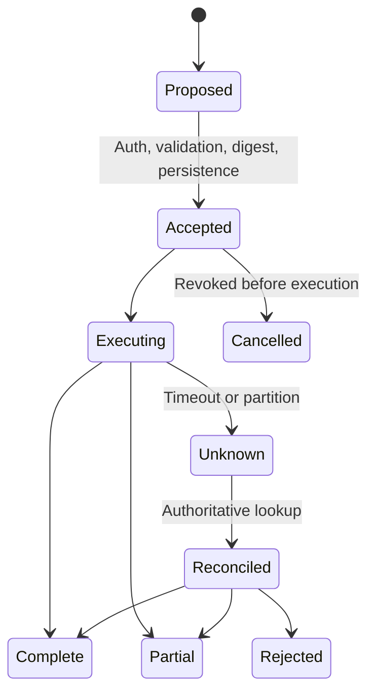
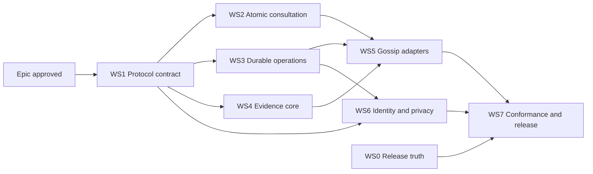

# Epic: Gossip Protocol v2

Atomic consultations, verifiable evidence, durable receipts, and server
reconciliation.

Design source: [Gossip Protocol v2 proposal](../proposals/gossip-protocol-v2.md).
Tracking issue: [#3](https://github.com/xpelch/gossip/issues/3).
First active child: [WS1 contract foundation #4](https://github.com/xpelch/gossip/issues/4),
with [implementation notes](../protocol-v2.md).
The sections below preserve the approved design and acceptance requirements.

## Current status — 2026-09-11

The portable protocol and the Sherwood implementation are complete on the
coordinated review branches:

- [Gossip #28](https://github.com/xpelch/gossip/pull/28), tested source commit
  `30c30676fcc2f601db63181fbcd1326bf17e5926`;
- [Sherwood #464](https://github.com/xpelch/sherwood/pull/464), tested engine
  commit `017e592401b5a79edfbf9b2b7c8df01bd2cd555b`.

The public suite passes 193 tests with two expected Windows skips. The Sherwood
Gossip v2 and wallet-authentication suite passes 361 tests. Two clean-source conformance runs each pass
the exact thirteen-test process contract and independently match on their
stable replay projection. The published suite `.12` verifies 15 local scenarios,
including HTTP/MCP parity, exactly-once and zero-cost behavior, authentication,
sessions, owner isolation, private lifecycle controls, terminal persistence
faults, evidence finality and reorg behavior, and public conflict, correction,
and supersession lineage. See the
[published evidence](../acceptance/evidence/gossip-v2-2026-09-11/README.md).

The public v2 release is not approved yet. [WS7 #18](https://github.com/xpelch/gossip/issues/18)
still requires a public HTTPS endpoint and audience, a provenance-bound release
artifact, real version-pinned Grok Bot/Hermes/OpenClaw runs, applicable Linux
protected storage, production receipt trust and rotation, approved numeric
SLOs, and private-lifecycle policy approval. Capabilities remain `installed` or
`blocked` until their own production evidence passes.

Gossip exchanges, verifies, enriches, and propagates intelligence. It does not
prepare, sign, submit, or execute trades or blockchain transactions.

## Problem Statement

Gossip currently exposes four v1 MCP tools backed by Sherwood. The developer
preview proves protected local identity, endpoint-bound EIP-191 requests, local
operation fingerprints, conservative credit reservation, contribution
provenance, and a separate bounded trading preview.

The public v1 promise is still incomplete. Issues #1 and #2 remain open because
the project lacks a public endpoint, real version-pinned runs on every target
host, Linux protected-storage acceptance, release provenance, and several engine
interoperability guarantees.

The engine cannot atomically bind consultation quality to a cost ceiling. A
local client can reserve credit conservatively, but it cannot guarantee that a
standard request stays standard. A timeout cannot be reconciled authoritatively
across installations. Results also lack one portable contract for provenance,
freshness, finality, reproduction, correction lineage, and receipt integrity.

Agents therefore cannot reliably determine what Gossip knows, why it believes
it, how fresh it is, what it cost, or whether retrying is safe.

## Solution

Deliver an explicitly negotiated Gossip Protocol v2 around three primitives:

1. **Atomic query contract:** bind tier, freshness, finality, deadline, and
   maximum cost. Standard plus zero maximum cost returns a standard result or a
   deterministic refusal and consumes no earned credit.
2. **Evidence and receipt contracts:** publish canonical, content-addressed
   evidence bundles and verifiable signed receipts with correction lineage.
3. **Server reconciliation:** durably bind an operation ID to its canonical
   request digest and economic state before work. Same ID and content returns
   existing state; different content fails; unknown outcomes cannot be repeated
   until reconciled.

Freeze the four v1 tools, request schemas, exact authentication identifiers,
legacy headers, and observable error behavior. Introduce a separate v2 namespace
with explicit capability negotiation. Installed code never implies engine,
standard, or host support.

Gossip remains the product and portable contract. Sherwood remains the only
production intelligence engine in this epic. Identity, delegated authorization,
payment, reputation, and trading stay separate authorities.

## User Stories

### Discovery and compatibility

1. As an agent, I want to discover protocol, schema, authentication, limit, and
   optional-feature revisions, so that I do not infer support from installation.
2. As a v1 client, I want existing contracts preserved, so that v2 adoption does
   not break my integration.
3. As a v2 client, I want explicit negotiation, so that semantics never change
   silently.
4. As an operator, I want fingerprints namespaced by protocol revision, so that
   v1 and v2 operations cannot collide.
5. As a user, I want capabilities reported as installed, verified, not
   applicable, or blocked, so that partial readiness is clear.
6. As a user, I want one actionable next step for every blocker.
7. As an auditor, I want each result to name its protocol, schema, server, and
   authentication revisions.
8. As an integration author, I want equivalent MCP and HTTP semantics.

### Atomic consultations

9. As a user, I want every consultation to declare its quality tier.
10. As a user, I want a maximum cost enforced by the server.
11. As a standard-tier user, I want zero maximum cost to consume zero earned
    credit.
12. As an agent, I want freshness requirements bound to the request.
13. As an agent, I want finality requirements bound to the request.
14. As a user, I want a deadline so that stale authorization cannot execute.
15. As an operator, I want selected tier, reservation, charge, and settlement
    state in the receipt.
16. As a user with insufficient budget, I want deterministic refusal without
    partial spending.
17. As an operator, I want concurrent installations unable to bypass limits
    through stale client preflight checks.
18. As a user, I want partial results labelled with unmet requirements.
19. As a client author, I want stable errors for unsupported tier, excessive
    cost, stale deadline, unmet finality, and unavailable evidence.
20. As a user, I want revocation to stop new authorization while preserving the
    state of accepted work.

### Evidence and corrections

21. As an agent, I want material claims represented as typed evidence bundles.
22. As an agent, I want every claim to identify subject, kind, provenance,
    observation time, and content digest.
23. As an onchain user, I want chain, block hash and number, finality, and expiry
    attached to evidence.
24. As a non-chain user, I want source-specific validity semantics rather than
    incorrect chain terminology.
25. As an auditor, I want verification instructions for independent replay.
26. As a user, I want observed, relayed, and inferred claims distinguished.
27. As an agent, I want confidence components explained instead of receiving an
    opaque score.
28. As a validator, I want canonical digest vectors that expose tampering.
29. As a user, I want malformed, oversized, stale, or unverifiable evidence
    quarantined.
30. As a user, I want append-only corrections linked to superseded evidence.
31. As an auditor, I want acyclic, digest-bound derivation and correction
    lineage.
32. As a high-trust consumer, I want an independently reproducible path for
    every high-trust claim.
33. As an agent, I want conflicting evidence represented rather than erased by
    aggregation.
34. As a user, I want reorg-affected evidence revalidated under a published
    policy.
35. As a contributor, I want private evidence kept offchain and access
    controlled unless I consent to publication.
36. As a contributor, I want retention, export, deletion, and correction rules
    defined before private evidence is accepted.
37. As a contributor, I want a warning before a public hash or identity link is
    published because correlation can leak information.

### Durable operations and receipts

38. As a client, I want an operation ID bound to the canonical request digest
    before work begins.
39. As a retrying client, I want the existing state instead of duplicate work.
40. As a client reusing an ID with different content, I want deterministic
    rejection.
41. As a user, I want a timeout represented as unknown or reconciliation
    required rather than safe to repeat.
42. As an agent, I want operation lookup after process restart.
43. As a user, I want every accepted operation to receive a durable signed
    acknowledgment before its final receipt.
44. As a user, I want complete, partial, rejected, pending, and reconciliation
    required states distinguished.
45. As a receipt owner, I want lookup isolated from other identities.
46. As an auditor, I want receipts to bind operation digest, result digest,
    quality, economic state, timestamps, and server revision.
47. As an auditor, I want receipt keys to have published rotation and trust
    rules.
48. As a user, I want uncertain reservations retained until authoritative
    reconciliation.
49. As an operator, I want deterministic recovery around every persistence and
    external-work boundary.
50. As a user, I want uncertain operations to reach a terminal state within a
    published reconciliation window.

### Identity, hosts, and operations

51. As a user, I want my Gossip Identity Wallet to authenticate without
    implicitly authorizing payment or trading.
52. As a user, I want delegated session keys limited by endpoint, tools,
    submission kinds, expiry, and cost.
53. As a user, I want rotation linked by signed continuity without silently
    copying all permissions.
54. As a user, I want revocation to stop new authorizations without rewriting
    accepted history.
55. As a contract-wallet user, I want verification distinguished from execution
    authority.
56. As a user, I want ERC-8004 identity or trust data treated as optional
    discovery metadata.
57. As an MCP client, I want output schemas, structured content, and equivalent
    compatibility text.
58. As a client without MCP Tasks, I want durable lookup for long-running work.
59. As a contributor, I want feedback and correction to require explicit scope.
60. As an operator, I want telemetry to exclude prompts, private claims,
    signatures, tokens, secrets, and identifying source URLs.
61. As a security reviewer, I want discovery, submission, receipt, and
    reconciliation protected from enumeration and resource exhaustion.
62. As a host user, I want support advertised only after a real version-pinned
    end-to-end run.
63. As a user on a shared host, I want equal-privilege process access documented
    as part of the trust boundary.
64. As a product owner, I want activation measured by time to first verified
    consultation rather than successful installation.

## Implementation Decisions

### Boundaries and compatibility

- Treat v2 behavior as proposed until its conformance and deployment gates pass.
- Keep Gossip as product and protocol; keep Sherwood as its first engine.
- Maintain separate identity, evidence, and optional execution planes.
- Keep identity wallets, session keys, payment accounts, trading accounts,
  reputation, and model output as separate authorities.
- Freeze v1 names, schemas, headers, identifiers, and observable behavior.
- Negotiate v2 explicitly and forbid silent authentication downgrade.
- Pin the MCP revision and every optional standard profile used in acceptance.
- Keep trading outside the core evidence MCP and expose no generic signer.

### Canonical protocol contract

- Specify subject and actor identifiers, canonical serialization, Unicode and
  numeric normalization, enums, collection limits, maximum sizes, digest domain
  separation, and error taxonomy before schema freeze.
- Bind actor, subject, capability, protocol, quality, cost, freshness, finality,
  and deadline into the authenticated request.
- Namespace operation digests by protocol revision.
- Make server-side selection and reservation authoritative and atomic.
- Treat installed adapters as unavailable until real verifier support passes.

### Operation lifecycle

An operation is accepted only after authentication, schema validation,
canonical digest calculation, ID binding, and durable persistence succeed.
Pre-acceptance rejection has no operation receipt. Accepted work receives a
signed acknowledgment, then signed receipts as state changes.

- Persist digest and economic reservation before external work.
- Return the existing result for the same ID and digest; reject a different
  digest.
- Preserve unknown as a real state that releases no budget or duplicate work.
- Make result persistence and receipt issuance recoverable and idempotent.
- Derive v1 and v2 views from one reservation only after Sherwood provides one
  authoritative shared reservation contract.

### Evidence, identity, and privacy

- Publish evidence and receipt schemas before the broader tool surface.
- Require typed provenance, validity, source, digest, derivation, and correction
  fields, with chain finality data where relevant.
- Apply size, recursion, and acyclic-lineage limits at ingestion.
- Treat confidence as ranking metadata and preserve the evidence path.
- Publish receipt trust anchors, key rotation, expiry, and verifier behavior.
- Scope session keys; require signed continuity; transfer permissions explicitly.
- Keep raw private evidence offchain and out of telemetry.
- Require explicit consent for public commitments and linkable associations.
- Approve retention, export, deletion, access-audit, and correction policy before
  private v2 submission is enabled.

### Proposed MCP surface

Keep the four v1 tools. Add `gossip_capabilities`, `gossip_consult_v2`,
`gossip_submit_v2`, `gossip_operation`, `gossip_receipt_v2`, and
`gossip_feedback`. Each tool returns schema-valid structured content and
equivalent JSON text. MCP Tasks remains negotiated and optional. HTTP and future
A2A adapters reuse the same protocol decisions.

## Workstreams and Dependencies

| Workstream | Scope | Exit gate |
| --- | --- | --- |
| WS0 — Release truth | Applicable #1/#2 endpoint, host, Linux storage, provenance, and installed-process evidence | Required before public v2 release |
| WS1 — Protocol contract | Identifiers, canonicalization, envelopes, errors, capabilities, schemas, vectors | Schema freeze |
| WS2 — Atomic consultation | Tier, freshness, finality, cost selection and reservation | No unauthorized credit use |
| WS3 — Durable operations | Operation binding, persistence, reconciliation, acknowledgments, receipts | Exactly one economic effect |
| WS4 — Evidence core | Provenance, finality, verification, corrections | Independently reproducible evidence |
| WS5 — Gossip adapters | MCP tools, structured output, HTTP parity, migration | Installed kit to real Sherwood v2 run |
| WS6 — Identity and privacy | Session keys, rotation, revocation, retention, telemetry | Security and privacy acceptance |
| WS7 — Conformance and release | Fault injection, compatibility, real hosts, release evidence | Public v2 release decision |

Recommended child issues:

1. Specify identifiers, canonical envelopes, capabilities, and errors.
2. Publish evidence and receipt schemas with canonical vectors; blocked by 1.
3. Implement Sherwood atomic quality and maximum-cost contract; blocked by 1–2.
4. Implement durable operation binding and reconciliation; blocked by 1–2.
5. Implement signed acknowledgments and lifecycle receipts; blocked by 2–4.
6. Implement evidence validation, finality, and correction lineage; blocked by
   2 and 5.
7. Add v2 MCP tools and structured output; blocked by 3–6.
8. Add scoped feedback and corrections; blocked by 6–7.
9. Add session-key rotation, continuity, and revocation; blocked by 1 and 4.
10. Add private-evidence lifecycle and redacted observability; blocked by 2, 4,
    and 6.
11. Add HTTP parity and optional Tasks; blocked by 7.
12. Prove v1/v2 migration and shared reservation; blocked by 3–5.
13. Run security, crash, concurrency, reorg, and privacy conformance; blocked by
    3–12.
14. Complete host, endpoint, packaging, and release acceptance; blocked by WS0
    and 13.

Trust and settlement pilots should become later epics after child 14.

## Testing Decisions

The primary seam is the installed Gossip CLI/MCP process through real signed
HTTPS requests to the actual Sherwood verifier and durable persistence, using
disposable synthetic identities. This extends the seams already accepted for
#1 and #2. Configuration-shape tests and local helpers do not establish engine
or host compatibility.

Supporting seams are:

1. canonical protocol vectors shared by the kit, Sherwood, and an independent
   verifier;
2. the real authentication verifier boundary;
3. the real server operation and reservation database;
4. real RPC or pinned controlled-chain evidence fixtures;
5. the packaged artifact on version-pinned Grok Bot, Hermes, and OpenClaw;
6. captured output, diagnostics, logs, and telemetry scanned for private data.

Acceptance requires:

- rejection of tampering, replay, wrong audience/path/query/body, expiry, wrong
  version, invalid canonical forms, and profile downgrade;
- deterministic limits for malformed, fuzzed, oversized, deeply nested, and
  cyclic inputs;
- zero earned-credit consumption for standard plus zero cost across concurrency,
  restart, crash, and retry;
- at least 100 concurrent or repeated uses of one ID and digest producing one
  durable operation and at most one economic effect;
- deterministic conflict for the same ID with a different digest;
- recovery around reservation, external work, result persistence, and receipt
  issuance without duplicate contribution or charge;
- queryable signed acknowledgments and final receipts after restart;
- owner-isolated operation and receipt lookup without enumeration;
- reorg, stale block, wrong chain, missing and conflicting source, correction,
  and supersession coverage;
- independent reproduction of every claim classified high trust;
- unchanged v1 behavior and equivalent v2 MCP structured/text/HTTP results;
- zero prohibited secrets or private evidence in telemetry scans;
- real version-pinned acceptance for every advertised host;
- synthetic identities, controlled contracts, and non-production funds only.

Numeric latency and reconciliation SLOs must be approved before release. Publish
latency percentiles, pending-operation age, replay rejection, RPC divergence,
and correction latency with defined denominators.

## Out of Scope

- Breaking or silently migrating the frozen v1 public contract.
- Multiple production intelligence engines or federation.
- Public reputation, wallet-vote reputation, or a general trust marketplace.
- Activating ERC-8004, ERC-8183, ERC-8257, or settlement without a separately
  approved pinned profile and deployment.
- Token issuance, production payments, monetary rewards, or public settlement.
- Generic signing, arbitrary calldata, autonomous trading, or merging trading
  into the evidence MCP.
- Using identity or reputation as implicit payment or trading authority.
- Onchain publication of private evidence or hashes by default.
- Gossip-hosted key custody.
- Universal OAuth, ERC-8128, contract-wallet, Tasks, HTTP/A2A, or host claims
  without real conformance evidence.
- Production keys, user funds, mainnet trades, or public registration in tests.
- New account-abstraction or delegation standards without a separate spec.

## Further Notes

The order is deliberate: atomic consultation, evidence and receipt contracts,
then server reconciliation precede trust, payment, or federation.

Issues #1 and #2 are open dependencies. Their `ready-for-agent` labels authorize
work but do not prove external engine, endpoint, host, release, or storage
dependencies are delivered.

The following decisions remain gates inside the child plan: canonical identity
and subject encoding; serialization and digest rules; supported MCP and auth
profiles; receipt signer and retention; private-evidence lifecycle; exact state
transitions; cost units and refunds; evidence-type freshness/finality; high-trust
criteria; feedback authorization; reconciliation window; and latency SLOs.

The epic is complete only when WS7 publishes evidence for the final integrated
state. Passing an individual child issue does not establish v2 release readiness.
