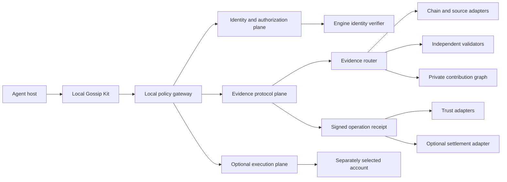
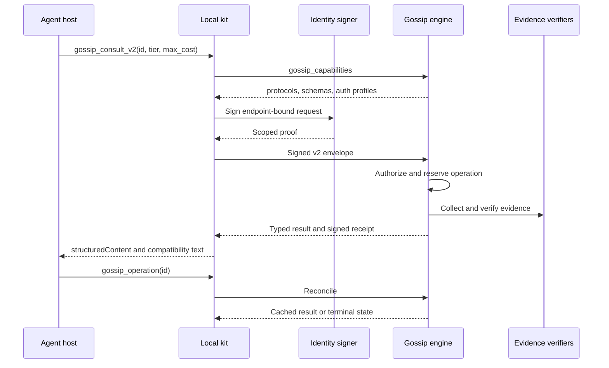
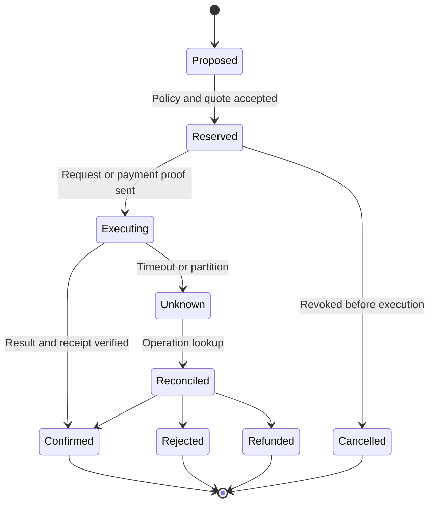

# Gossip Protocol v2: verifiable intelligence for agents

Status: product and protocol proposal. This document is not an accepted
specification, a compatibility claim, or evidence of a deployed service.

## Thesis

Gossip should become the verifiable evidence exchange for autonomous agents.
An agent asks an onchain question, receives a typed answer with provenance and
freshness, can independently verify it, contributes private observations under
explicit consent, and receives a durable receipt tied to identity and value.

The defensible loop is:

```text
request -> evidence -> verification -> receipt -> consented contribution
        -> better future evidence
```

MCP is the agent-facing interface. Sherwood is the first intelligence engine.
Ethereum gives identities, attestations, and optional settlement a portable
anchor. None of those components should become the product by itself.

The product promise is simple: **an agent can tell what Gossip knows, why it
believes it, how fresh it is, what it cost, and how to correct it.**

## Recommendation

Build the next release around three protocol primitives:

1. a query contract that atomically binds quality, freshness, finality, and
   maximum cost;
2. a portable evidence bundle that makes claims reproducible;
3. a durable signed receipt that reconciles retries, corrections, and value.

Keep Sherwood as the only production engine until those primitives work across
real hosts. Add ERC-8004 discovery and trust as an adapter after the evidence
model is stable. Pilot settlement only after server-side idempotency, refund,
and finality semantics exist.

Do not make federation, a token, public reputation, autonomous trading, or
onchain storage of private evidence part of the first v2 milestone. They add
failure modes before the core evidence loop is proven.

## Current baseline

At revision `4331000`, Gossip is a developer preview:

- the local bridge exposes `agent_access`, `agent_consult`, `gossip_submit`,
  and `gossip_receipt`;
- the exercised engine profile is endpoint-bound EIP-191 authentication with a
  signed body hash, nonce, and expiry;
- operations have local fingerprints and conservative credit reservations;
- submissions distinguish observed, relayed, and inferred provenance and can
  refer to evidence or corrections;
- identity keys remain user controlled, and trading authority is separate;
- ERC-8004 and ERC-1271 helpers exist locally, while ERC-8128 engine
  interoperability is still blocked;
- no public endpoint, package release, payment flow, reputation system, or
  completed host acceptance exists.

The v2 design builds on those boundaries. It does not weaken them or turn an
installed SDK into a support claim.

## Architecture

The design has three planes with separate authority. A reputation score cannot
authorize a payment, an identity key cannot implicitly trade, and a model cannot
expand the policy that contains it.



### Identity and authorization plane

This plane answers who may invoke a capability and within which limits. It
supports key enrollment, rotation, expiry, revocation, and signed continuity.
The authenticated principal is a tuple of authentication profile, chain
namespace, address, and key identifier. An optional ERC-8004 registry and agent
ID can enrich discovery; an address alone does not prove a person, organization,
or trustworthy agent.

Three authorities remain distinct:

1. **Gossip Identity Wallet** owns access and contribution continuity.
2. **Delegated session key** is scoped to endpoint, tools, submission kinds,
   expiry, and cost ceiling.
3. **Payment or trading account** is separately selected and authorized.

For HTTP clients, Gossip should support the MCP OAuth authorization profile and
its Protected Resource Metadata discovery. Background agents can later use the
official MCP client-credentials extension where their host supports it. A
wallet-native ERC-8128 profile remains opt-in until the real engine passes
conformance vectors. Clients pin an accepted profile and never silently
downgrade to legacy EIP-191.

### Evidence protocol plane

This is the product core. It converts chain reads, private observations, and
engine inference into versioned evidence bundles. Every material claim carries
its origin, observation time, chain reference where applicable, freshness,
content digest, and correction lineage.

Confidence is a ranking signal with explainable components:

- provenance: observed, relayed, or inferred;
- reproducibility against a source or block reference;
- freshness and finality;
- corroboration by independent sources;
- issuer or validator policy;
- correction and outcome history.

Confidence never substitutes for evidence. A high score without a reproducible
path remains an unverified assertion.

### Value and execution plane

Credits and payments buy an operation; they do not grant general wallet access.
A future settlement flow is quote, local authorization, reservation, execution,
and receipt. It binds the operation, payer, asset, network, recipient, maximum
amount, expiry, refund policy, and result digest.

The current local Robinhood Chain trading preview remains separate from the
Gossip evidence MCP. No generic signing or arbitrary-calldata tool belongs in
the core Gossip surface.

## Versioned protocol envelope

V1 remains frozen. V2 introduces a new schema namespace and canonical test
vectors. The following shape is illustrative; the eventual specification must
define serialization, digest, limits, and every enum normatively.

```json
{
  "protocol": "gossip.v2",
  "operation_id": "stable-id",
  "actor": {
    "profile": "erc8128-rfc9421-v1",
    "chain_namespace": "eip155",
    "chain_id": 4663,
    "address": "0x...",
    "key_id": "session-key-2"
  },
  "capability": "consult",
  "quality": {
    "tier": "standard",
    "max_cost": "0",
    "freshness_seconds": 300,
    "finality": "safe"
  },
  "deadline": "2026-09-09T18:00:00Z",
  "request": {
    "subject": "eip155:4663:0x..."
  }
}
```

The response envelope contains:

- protocol and server revision;
- operation and receipt IDs;
- `pending`, `complete`, `partial`, `rejected`, or
  `reconciliation_required` status;
- selected quality tier and exact reservation or settlement state;
- typed claims and evidence bundles;
- verification steps and their outcomes;
- correction and supersession links;
- a signed receipt digest.

The first required engine change is an **atomic quality contract**.
`tier=standard` with `max_cost=0` produces a standard result or a deterministic
refusal. It never silently consumes earned credit. This directly fixes the
current legacy-engine limitation.

The second required change is server-side idempotency. The engine durably binds
an operation ID to its request digest before work begins. Retrying the same ID
returns the existing result or reconciliation state. Reusing it with different
content fails. A timeout never authorizes a second charge or contribution.

## Evidence bundle

An evidence bundle should be content addressed and independently inspectable:

```json
{
  "schema": "gossip.evidence.v1",
  "claim_id": "urn:gossip:sha256:...",
  "subject": "eip155:4663:0x...",
  "kind": "pool_discovery",
  "claim": {},
  "provenance": "observed",
  "observed_at": "2026-09-09T17:54:00Z",
  "validity": {
    "chain_id": 4663,
    "block_number": "123456",
    "block_hash": "0x...",
    "finality": "safe",
    "expires_at": "2026-09-09T18:04:00Z"
  },
  "evidence": [
    {
      "type": "transaction",
      "reference": "0x...",
      "content_hash": "sha256:..."
    }
  ],
  "derived_from": [],
  "supersedes": null
}
```

Raw private evidence stays offchain and access controlled. Public commitments
or aggregate trust signals are published only with explicit consent. A public
hash is permanent and can still leak information through correlation, so it is
not a privacy default.

## MCP surface

Keep the four v1 tools unchanged during migration. Add a separately versioned
surface:

| Tool | Purpose | Authority | Task support |
| --- | --- | --- | --- |
| `gossip_capabilities` | Protocol, schemas, auth profiles, limits, trust and payment modes | Read only | Forbidden |
| `gossip_consult_v2` | Query with tier, freshness, finality and maximum cost | Read scope plus cost policy | Optional |
| `gossip_submit_v2` | Submit content-hashed evidence and correction lineage | Explicit submission-kind scope | Optional |
| `gossip_operation` | Reconcile pending or unknown work | Owner of operation | Forbidden |
| `gossip_receipt_v2` | Retrieve typed receipt and verification material | Owner of receipt | Forbidden |
| `gossip_feedback` | Submit user-confirmed outcome or correction | Explicit feedback scope | Optional |

Every tool defines an MCP `outputSchema` and returns `structuredContent`, plus
serialized JSON text for older clients. Annotations improve host UX but never
grant authority. Long verification can use the negotiated MCP Tasks extension;
clients without it use durable operation lookup.

Expose the same envelopes through an HTTP API for indexers, auditors, and A2A
adapters. MCP remains the agent-facing adapter rather than the only protocol
representation.



## Trust network

ERC-8004 is a useful optional adapter for discovery, identity, feedback, and
validation. It remains a draft and must be pinned by revision and deployment.
Gossip should export an agent registration document that advertises the MCP
endpoint and supported protocol revision, then verify the onchain wallet
association before displaying it as validated.

The trust ladder presented to agents is:

1. **Direct:** reproducible chain or source evidence.
2. **Corroborated:** agreement across independent sources.
3. **Validated:** replayed or attested by an independent validator.
4. **Contributed:** private user evidence with consent and lineage.

Reputation is multidimensional and domain specific. It can affect ranking or
required corroboration, but it never grants submission, payment, or trading
authority. Sybil resistance combines quotas, rate limits, reviewer weighting,
optional attestations, and selective economic friction. Counting wallet votes
is insufficient.

ERC-8257 may later provide a standard tool-discovery and pricing manifest, and
ERC-8183 may later provide an agentic-commerce adapter. Both are draft
dependencies, not launch requirements or current support claims.

## Operation and settlement lifecycle



`Unknown` is a real state. It is never presented as failed, refunded, or safe to
repeat. Revocation stops new authorization but does not erase already accepted
work. Settlement cannot launch until expiry, finality, refund, dispute, and
facilitator trust rules are explicit.

## Security and privacy contract

| Threat | Required control |
| --- | --- |
| Replay or duplicate work | Durable nonce store and server operation idempotency |
| Wrong endpoint, audience, or body | Exact resource binding and content digest |
| Authentication downgrade | Client-pinned profile and no silent fallback |
| Shared-host key theft | Protected storage, short-lived scoped keys, rotation and revocation |
| Budget bypass | Atomic tier and cost contract enforced by the server |
| Evidence poisoning | Strict schemas, quarantine, provenance, lineage, independent validation |
| Sybil or self-reputation | Quotas, reviewer weighting, attestations, selective friction |
| Chain reorg or stale evidence | Block hash and number, finality, revalidation policy |
| Partition or crash | Explicit unknown state and reconciliation before retry or refund |
| Privacy leakage | Data minimization, redacted telemetry, retention, export, and deletion policy |
| Draft-standard drift | Version-pinned adapters and compatibility matrices |
| Cross-installation overspend | Server reservation or an explicit single-writer lease |

Telemetry must exclude raw prompts, private claims, signatures, tokens, wallet
secrets, and identifying source URLs. Use short-lived correlation IDs and
publish retention periods. Ethereum addresses and registry associations are
linkable by design; setup must explain that before publication.

## Compatibility and migration

- Freeze v1 names, request schemas, legacy headers, and error behavior.
- Negotiate v2 explicitly; installed packages do not imply support.
- Namespace operation fingerprints by protocol revision.
- During migration, derive compatible v1 and v2 receipts from one economic
  reservation.
- Shadow-verify new authentication profiles before enabling them.
- Canary profile migrations and retain an explicit rollback.
- Preserve identity and contribution history with signed key-continuity
  records; rotated keys do not silently inherit every permission.
- Market a host only after a real, version-pinned end-to-end run.
- Keep `installed`, `verified`, `not-applicable`, and `blocked` capability states
  distinct.

## Roadmap

### Phase 0: release truth

Finish the existing gates: public endpoint, real host runs, Linux protected
storage, release provenance, atomic standard-only engine support, and full
installed-process interoperability. This is prerequisite work, not v2 polish.

### Phase 1: protocol foundation

Publish versioned JSON Schemas, canonical vectors, error taxonomy, capability
negotiation, operation state machine, server idempotency, and typed MCP output.
Do not add payments in this phase.

### Phase 2: evidence network

Add hash-addressed evidence bundles, chain finality, correction lineage,
independent validation, key rotation, privacy/retention controls, and redacted
OpenTelemetry observability.

### Phase 3: trust pilot

Add opt-in attestations and a version-pinned ERC-8004 adapter. Measure Sybil
resistance, false rejection, correction latency, and the reproducibility of
high-trust claims.

### Phase 4: economic pilot

Enable one settlement adapter for allowlisted identities with low limits,
explicit authorization, refunds, finality policy, and an emergency stop. Keep
the payer separate from identity and trading authority.

### Phase 5: ecosystem

Publish HTTP and SDK contracts for indexers, auditors, registries, and A2A
clients. Consider federation only after portable envelopes, abuse controls,
and privacy semantics work with one production engine.

## First three implementation bets

1. **Atomic query contract:** add explicit tier, freshness, finality, and
   maximum cost to the engine request. This removes the largest current safety
   and product ambiguity.
2. **Evidence and receipt schemas:** publish `gossip.evidence.v1` and
   `gossip.receipt.v2` with canonical vectors before adding more tools. This is
   the foundation for verification, corrections, and settlement.
3. **Server reconciliation:** persist operation digest and state before work,
   then expose lookup by operation ID. This closes the gap between a local
   retry journal and network-wide idempotency.

Only after those three bets should the team invest in public reputation,
payments, or federation.

## Success criteria

- Every conformance vector rejects tampering, replay, wrong audience, expiry,
  and profile downgrade.
- No unauthorized submission, payment, or duplicate charge appears in retry,
  restart, partition, and concurrency tests.
- Every accepted v2 operation has a durable, queryable receipt.
- At least 99% of completed consultations expose provenance and block/finality
  metadata; exceptions are explicitly marked partial.
- Every high-trust claim has an independently reproducible verification path.
- Every uncertain paid operation reaches a declared terminal state inside its
  reconciliation window.
- Automated telemetry scans find no secret, token, signature, or raw private
  claim.
- The service publishes latency percentiles, pending-operation age, replay
  rejection, RPC divergence, and correction latency.
- Each advertised host has a real version-pinned acceptance run.
- Product activation is measured as time to first verified consultation, not
  successful installation.

## Decisions required before specification

The team must still choose:

- the canonical v2 subject and identity identifiers;
- receipt retention and private-evidence deletion rules;
- the supported MCP protocol revision and auth profiles;
- the ERC-8004 registry deployment and revision policy;
- settlement asset, finality, refund, and dispute semantics;
- whether federation is a long-term requirement.

Centralizing on Sherwood first is recommended. Federation expands moderation,
consistency, privacy, and Sybil risks before the portable protocol has evidence
of product-market fit.

## Primary references

- [MCP 2025-11-25 overview](https://modelcontextprotocol.io/specification/2025-11-25/basic)
- [MCP tools and structured output](https://modelcontextprotocol.io/specification/2025-11-25/server/tools)
- [MCP authorization](https://modelcontextprotocol.io/specification/2025-11-25/basic/authorization)
- [MCP Tasks extension](https://modelcontextprotocol.io/extensions/tasks/overview)
- [MCP OAuth client-credentials extension](https://modelcontextprotocol.io/extensions/auth/oauth-client-credentials)
- [ERC-8004: Trustless Agents](https://eips.ethereum.org/EIPS/eip-8004)
- [ERC-8128 project specification](https://erc8128.org/)
- [ERC-8183: Agentic Commerce](https://eips.ethereum.org/EIPS/eip-8183)
- [ERC-8257: Agent Tool Registry](https://eips.ethereum.org/EIPS/eip-8257)
- [RFC 9421: HTTP Message Signatures](https://www.rfc-editor.org/rfc/rfc9421)
