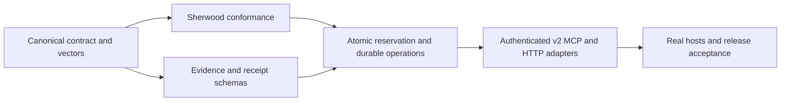

# Gossip v2 contract foundation

This developer contract contains the first three implementation slices of
[epic #3](https://github.com/xpelch/gossip/issues/3), tracked as
[WS1 #4](https://github.com/xpelch/gossip/issues/4),
[WS2 #6](https://github.com/xpelch/gossip/issues/6), and the portable
authenticity portion of [WS3 #9](https://github.com/xpelch/gossip/issues/9).
The portable session-authorization portion of
[WS6 #15](https://github.com/xpelch/gossip/issues/15) is also executable but
remains inactive.
The revision is `gossip/2-draft.1`. It is a candidate for engine integration;
there is no public v2 endpoint or active v2 tool in the kit.

See the 2026-09-09 acceptance records for the
[contract foundation](acceptance/v2-contract-foundation.md) and
[evidence and receipts](acceptance/v2-evidence-receipts.md) for tested artifacts,
results, and explicit remaining gates.

## What is executable

- `canonicalJson` encodes bounded JSON values without ambiguous number or
  Unicode conversions. `parseCanonicalJson` accepts only those exact UTF-8 bytes.
- `canonicalDigest` separates request, evidence, and receipt content hashes.
  Hashing arbitrary data does not prove its truth or satisfy an evidence schema.
- `parseConsultation` validates the candidate request and its deadline.
  `consultationDigest` binds the validated envelope without consulting a clock.
- `negotiateCapabilities` compares a supplied report with an independently
  configured endpoint, audience, and profile. It returns selected revisions and
  limits. It performs no network call and grants no authority.
- `parseEvidenceEnvelope` and `parseEvidenceGraph` validate immutable evidence,
  complete bounded lineage, corrections, conflicts, and owner-compatible access.
- `assessEvidenceGraph` evaluates declared freshness, expiry, canonicality, and
  finality with an explicit clock. It does not query an RPC or prove that a
  historical block remains canonical.
- `parseResultManifest` binds result roots to a subject and
  `validateResultPacket` checks those roots against a validated graph.
- `parseSignedReceipt`, `validateReceiptConsultation`, and
  `validateReceiptTransitionChain` check receipt encoding, content integrity,
  request binding, economic invariants, and lifecycle transitions. They do not
  authenticate the signature or choose a production signer.
- `parseReceiptTrustManifest`, `verifySignedReceipt`, and
  `verifyReceiptTransitionChainAuthenticity` verify the separate
  `gossip-eip191-receipt-v1` profile against an operator-pinned manifest,
  including the exact EIP-191 message, low-S signature, recovery key, server,
  profile, key ID, validity interval, and chain key pinning.
- `verifyIdentitySessionGrant`, `verifyIdentitySessionChain`,
  `verifyIdentitySessionRevocation`, and `authorizeIdentitySession` validate
  root-signed, information-only session grants, explicit rotation scope,
  revocation, expiry, destination, and canonical signed request envelopes whose
  bytes bind the tool, submission kind, earned-credit ceiling, and complete
  payload. They do not register keys or authorize payment, trading, generic
  signing, or transaction execution.

The exact fields, resource limits, and validation semantics are specified in
[ADR 0003](adr/0003-v2-canonical-contract.md) and
[ADR 0004](adr/0004-v2-evidence-and-receipts.md), and
[ADR 0005](adr/0005-v2-receipt-authenticity.md),
[ADR 0006](adr/0006-v2-http-authentication.md), and
[ADR 0007](adr/0007-v2-identity-session-authorization.md), and
[ADR 0008](adr/0008-v2-private-evidence-lifecycle.md). Source modules and declarations
are shipped under `dist/canonical.js`, `dist/protocol-v2.js`,
`dist/evidence-v2.js`, `dist/receipts-v2.js`, `dist/receipt-auth.js`, and
`dist/identity-session.js` after build. The synthetic private-evidence policy,
root-signed publication consent, owner operations, tombstones, and closed
observability schemas are shipped under `dist/privacy-v2.js`. They are separate
from `serve` and `setup`, and do not activate private submission.

## Reproduce the contract checks

From this repository with Node 24 and Python 3:

```sh
npm ci --ignore-scripts
npm run build
npm run test:protocol-v2
npm run verify:protocol-v2
npm run verify:evidence-v2
npm run verify:identity-session-v2
npm run verify:privacy-v2
```

The Python verifiers use only the standard library. They independently implement
the restricted JSON profile and verify stored canonical bytes, digests, lineage,
receipt states, and representative invalid cases in `test/fixtures`. Node
consumes the same literal vectors through the public TypeScript boundary. The
fixtures and verifiers are included in the npm tarball so an engine author can
verify the installed artifact.

Fixtures contain only synthetic addresses, reserved `.test` URLs, fixed
timestamps, and synthetic deterministic keys. They are conformance examples,
not connection configuration or production trust anchors. The receipt verifier
is offline and consumes a manifest supplied by the operator; it does not
discover keys or perform TOFU. Server signing, manifest distribution,
private-key loading, retention, and rotation-event enforcement remain
unapproved.

## Integration order



Downstream adapters must enforce the smaller negotiated limits before sending,
authenticate discovery, bind the selected revisions to a verified connection,
and validate the actor against the real signer. A timeout is still unknown;
a content digest or capability report cannot release a credit reservation.

The v2 HTTP verifier requires operator-trusted audience and endpoint
configuration. It must not infer either value from `Host`, `Forwarded`, or
unvalidated `X-Forwarded-*` headers. The verifier hashes the raw `Uint8Array`
body; text decoding belongs after authentication.
Fresh authentication nonces must not change a logical operation's digest.

The protocol cannot promote an observation into a verified trading signal.
Engine evidence must retain source revision, canonical block/transaction hashes,
the observation window, freshness, finality, and explicit unknowns. A recent
retrieval does not refresh old facts. Research heuristics retain their limitations
until predictive validation is established by the engine's own evidence.

These module tests do not prove server idempotency,
exactly one durable charge, RPC revalidation, private evidence operations, host
support, or a public release. Those gates remain on epic #3 and the applicable
acceptance dependencies in issues #1 and #2.

The private-evidence contract and synthetic retention values are documented in
`docs/privacy-v2.md`. Adapters must keep `private_submission` blocked until the
engine proves encrypted owner-scoped storage, complete deletion across every
copy, durable access audit, crash-safe owner operations, zero telemetry leakage,
and an approved production policy revision.
